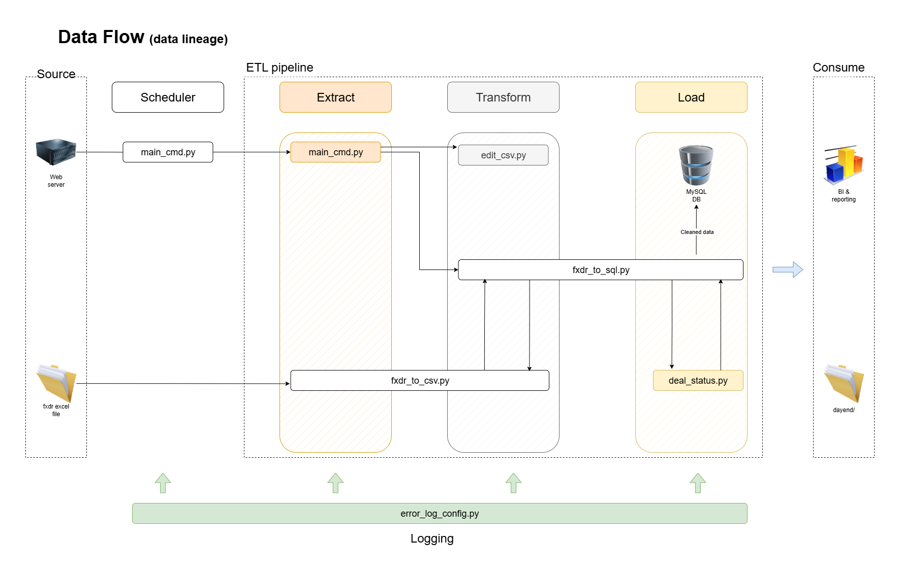

# ⚙️ Automated Trading ETL Pipeline

This project implements a robust **ETL pipeline** for automating the extraction, transformation, and loading of trading data from a secure financial platform. It is designed to run on a scheduled basis, clean and enrich the data, update a MySQL database, and generate structured deal commands for downstream use.

---

## 📁 Table of Contents

- [Overview](#overview)
- [Features](#features)
- [Installation](#installation)
- [Usage](#usage)
- [Configuration](#configuration)
- [ETL Workflow](#etl-workflow)
- [Modules](#Modules)
- [Project Structure](#project-structure)
- License(#license)

---

## 📊 Overview

This ETL pipeline automates:

- **Extraction**: Logging into a trading platform and downloading multiple CSV reports.
- **Transformation**: Cleaning, enriching, and merging data using Pandas and Excel macros.
- **Loading**: Updating a MySQL database and generating structured deal commands.

It is designed for daily execution and supports seasonal scheduling (Summer/Winter).

---

## 🚀 Features

- Scheduled execution via Python's `schedule` module.
- Automated login and data download using `twill`.
- Data cleaning and augmentation with Pandas.
- Excel macro refresh and extraction using `win32com`.
- MySQL integration for deal tracking.
- Structured deal command generation.
- Centralized error logging.

---

## 🛠️ Installation
1. **Clone the repository:**
   ```sh
   git clone https://github.com/sleepySummer/auto_DayEnd.git
   cd auto_DayEnd
   ```
2. **Install dependencies:**
pip install -r requirements.txt

## Usage

1. **Set Up Configuration:**
   - Create a seperated `config.py` file in the project directory with your individual login credentials:
     ```python
     # config.py
     itrade_username = "your_username"
     itrade_password = "your_password"
     mysql_password = "your_password"
     ```

2. **Run the Script:**
   - Execute the main script, or scheduler, to start the process:
     ```sh
     python main_cmd.py
     ```


## Configuration

- **config.py:** This file contains the login credentials required to access the trading website. Ensure this file is in the same directory as `main_cmd.py` and is not included in version control for security reasons.

- **cerror_log_config.py:** Initializes error logging to error_log.txt.

## Workflow


## Modules

### main_cmd.py – Scheduler
- Launches cmd_app.py at scheduled times based on season.

### cmd_app.py – Extract
- Logs into the trading site.
- Downloads multiple CSV reports.
- Initiates transformation and loading steps.

### edit_csv.py – Transform
- Cleans raw data and appends test deals to DealList.

### fxdr_to_csv.py – Transform
- Refreshes and loads data from FXDR_v5.xlsm.
- Cleans and exports to current_deal.csv.

### fxdr_to_sql_v2.py – Load
- Inserts or updates deal records in MySQL.
- Triggers deal command generation.

### deal_status.py – Transform & Output
- Generates structured deal commands (OpenMarket, Rollover, CloseMarket).
- Saves output to new_testdeal.csv.

### error_log_config.py – Logging
- Configures centralized error logging.

## Project Structure

├── .github/ │ └── workflows/ │ └── etl_pipeline.yml # GitHub Actions CI/CD workflow ├── docs/ │ └── autodayend_etl_pipeline.png # Final ETL flowchart diagram ├── .gitignore # Git ignored files list ├── README.md # Project documentation ├── README_backup.md # Backup copies of README ├── README_1_backup.MD # Backup copies of README ├── cmd_app.py # Main controller to orchestrate all ETL scripts ├── data_architecture.png # Data architecture visual ├── deal_status.py # Check & update FX deal status post-ETL ├── edit_csv.py # Transform logic to clean/edit CSV data ├── error_log_config.py # Centralized error logging setup ├── etl_chart.png # ETL chart or draft diagram ├── fxdr_to_csv.py # Extractor from Excel → CSV ├── fxdr_to_sql_v2.py # Loader module to write cleaned data to SQL ├── main_cmd.py # Initial script (used in scheduler) └── requirements.txt # Python dependencies

## License
- Copyright (c) 2024 [Ian Chi]

Permission is hereby granted, free of charge, to any person obtaining a copy
of this software and associated documentation files (the "Software"), to deal
in the Software without restriction, including without limitation the rights
to use, copy, modify, merge, publish, distribute, sublicense, and/or sell
copies of the Software, and to permit persons to whom the Software is
furnished to do so, subject to the following conditions:

The above copyright notice and this permission notice shall be included in all
copies or substantial portions of the Software.

THE SOFTWARE IS PROVIDED "AS IS", WITHOUT WARRANTY OF ANY KIND, EXPRESS OR
IMPLIED, INCLUDING BUT NOT LIMITED TO THE WARRANTIES OF MERCHANTABILITY,
FITNESS FOR A PARTICULAR PURPOSE AND NONINFRINGEMENT. IN NO EVENT SHALL THE
AUTHORS OR COPYRIGHT HOLDERS BE LIABLE FOR ANY CLAIM, DAMAGES OR OTHER
LIABILITY, WHETHER IN AN ACTION OF CONTRACT, TORT OR OTHERWISE, ARISING FROM,
OUT OF OR IN CONNECTION WITH THE SOFTWARE OR THE USE OR OTHER DEALINGS IN THE
SOFTWARE.
